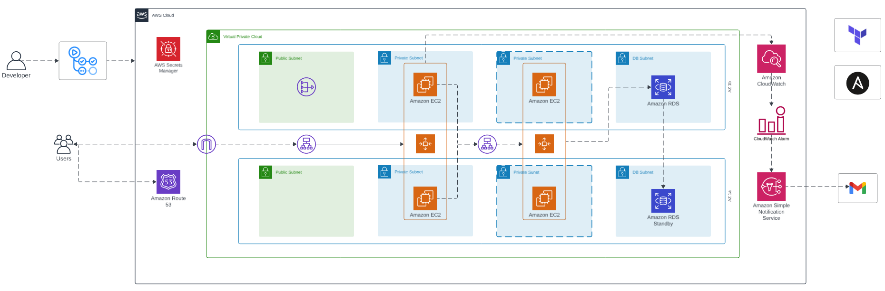

# Three-Tier Architecture Deployment

This repository contains the configuration and setup for deploying a three-tier architecture on AWS that supports two applications within a single infrastructure. The setup includes host-based routing, internal load balancers for app/backend tiers, monitoring & logging, SNS notifications, cost calculation, architecture diagrams, and documentation.

## Table of Contents

- [Architecture Overview](#architecture-overview)
- [Infrastructure Components](#infrastructure-components)
- [Monitoring & Logging](#monitoring--logging)
- [SNS Notifications](#sns-notifications)
- [Cost Calculation](#cost-calculation)
- [Setup Instructions](#setup-instructions)
- [Architecture Diagram](#architecture-diagram)
- [Documentation](#documentation)
- [Presentation](#presentation)
- [Contributing](#contributing)
- [License](#license)

## Architecture Overview

The three-tier architecture consists of the following layers:
1. **Presentation Tier:** Hosts the frontend of both applications.
2. **Application Tier:** Contains the business logic and runs the backend services of both applications.
3. **Database Tier:** Manages data storage and retrieval.

Host-based routing directs traffic to the appropriate application based on the requested hostname.

## Architecture Diagram



## Infrastructure Components

- **Amazon EC2:** Instances for hosting the frontend and backend services.
- **Amazon RDS:** Database instances for data storage.
- **Amazon ALB (Application Load Balancer):** For external load balancing and host-based routing.
- **Amazon NLB (Network Load Balancer):** For internal load balancing between app and backend tiers.
- **Amazon CloudWatch:** For monitoring and logging.
- **Amazon SNS:** For notifications.

## Monitoring & Logging

Amazon CloudWatch is configured to monitor various metrics such as CPU utilization, memory usage, disk I/O, and application logs. Alarms are set to notify the admin team through SNS in case of threshold breaches.

## SNS Notifications

Amazon Simple Notification Service (SNS) is used to send notifications for various events such as CloudWatch alarms, deployment status, and system health.

## Cost Calculation

AWS Cost Explorer and Budgets are used to monitor and manage the costs associated with the infrastructure. Tags are implemented to track costs for each application separately.

## Setup Instructions

1. **Clone the Repository:**
   ```bash
   git clone https://github.com/yourusername/three-tier-architecture.git
   cd three-tier-architecture

## Configure Host-Based Routing

Update the ALB settings to direct traffic based on the hostname.

## Setup Monitoring & Logging

Configure CloudWatch metrics and alarms as per the code in terraform folder
